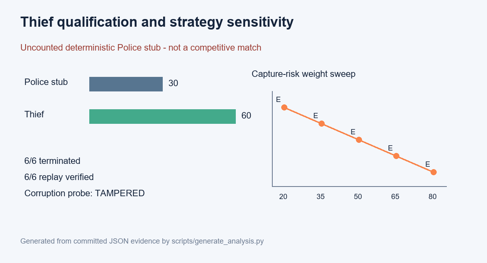
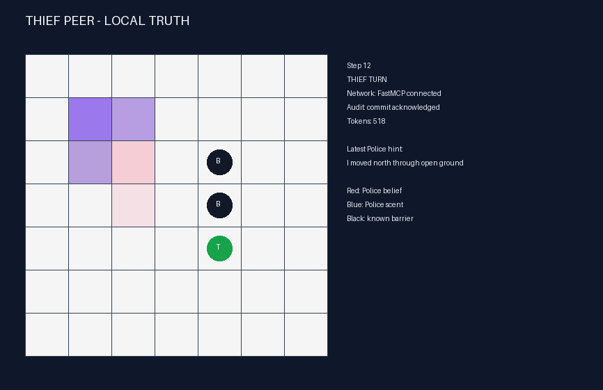
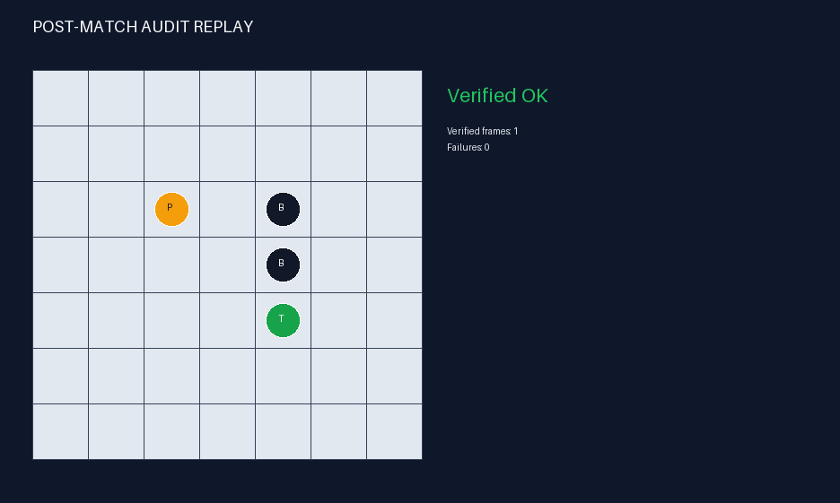

# Thief Agent

Standalone, from-scratch Thief peer for the distributed Police-and-Thief coursework game.
It shares no runtime code or live memory with Police: interoperability is limited to
versioned JSON contracts and FastMCP Streamable HTTP messages.

## Status and boundaries

The seven implementation milestones are complete, including the physical rules, Bayesian
evasion, optional grounded Ollama hints, commit-reveal audit, reliability controls,
artifacts, GUI/replay, and an uncounted six-game qualification harness. The harness uses a
deterministic, separately launched Police test stub. Its 6-0 result proves termination,
barrier handling, artifact generation, and tamper detection; it is **not evidence of win
rate against the companion Police agent**.

Submission metadata is intentionally unresolved: the eight-character `GROUP_ID`, student
identifiers, and public Police URLs must be supplied by the team. No counted match has
been run, Gmail live delivery has not been authorized, and no submission tag has been
created.

- Group ID: `GROUP_ID`
- Student IDs: `REPLACE_STUDENT_ID_1`, `REPLACE_STUDENT_ID_2`



## Scientific model

The interaction is treated as a two-agent, finite-horizon Dec-POMDP:

- State `s_t = (p_thief, p_police, barriers, scent, step, audit_state)` contains objective
  geometry and the public protocol state.
- Thief actions are `N/S/E/W/STAY`; Police actions are movement or permanent barrier
  placement. Python validates all physical actions.
- The Thief observation contains its position, public barriers, the observed 5x5 Police
  scent field, grounded hints, protocol state, and a Police-location belief inferred from
  the complete public deterministic scent transition. It
  does not contain objective Police movement or position.
- Physical transitions are deterministic once both legal actions are fixed. Observation
  uncertainty comes from partial sensing and non-binding truth/bluff language.
- Terminal utility is loaded from the hash-locked shared configuration: capture gives
  `(Police 20, Thief 5)`, survival gives `(Police 5, Thief 10)`, and a tie gives `(2, 2)`.

`EvasionStrategy` performs deterministic two-ply scoring over every locally legal move.
It minimizes next-step capture probability and enclosure/revisit risk while maximizing
belief distance, mobility, reachable area, and next-ply escape quality. The sensitivity
notebook varies the capture-risk coefficient without changing the fixed input state.

## Architecture

```text
CLI / Tk GUI
     |
  ThiefSdk -------- report / replay / peer lifecycle
     |
ThiefOrchestrator -- Bayesian observation -> EvasionStrategy -> grounded hint
     |                                         |
checkpoint + watchdog                    template or Ollama
     |
commit-reveal ledger <---- FastMCP client/server ----> independent Police peer
     |
validated artifacts -> verified replay -> protected Gmail reporter
```

Every wire request is strict and freshness-bound by game, subgame, step, sender, UUID,
configuration hash, previous-state hash, timestamp, and expiry. The seven published tools
are `health`, `negotiate`, `commit_turn`, `reveal_turn`, `capture_claim`, `final_audit`, and
`propose_result`. See [architecture](docs/architecture.md) and the
[protocol contract](docs/protocol.md).

## Language model policy

Movement is never delegated to an LLM. Template hints are the default and require no API.
Optional local Ollama `qwen3:8b` receives only prevalidated truth/bluff candidates, a
preferred intent, tactical objective, and word limit. Temperature is zero and seed is 42.
Strict JSON grounding rejects coordinates, unknown fields, conflicting directions, and
unapproved cues; any timeout or invalid output falls back deterministically. Prompt and
completion tokens are counted. A live smoke test produced a valid 15-word-or-shorter bluff
with 498 prompt and 20 completion tokens; see the
[prompt engineering log](docs/prompt-engineering-log.md).

## Install and inspect

Requirements: Python 3.12 and [`uv`](https://docs.astral.sh/uv/).

```powershell
git clone https://github.com/MohammdS/thief-agent.git
cd thief-agent
uv sync --frozen
uv run thief-agent doctor
uv run thief-agent validate config/game.json
```

Copy `config/game.toml.example` to the git-ignored `config/game.secret.toml`, then replace
the identity, opponent group, and endpoint placeholders. Start the autonomous Thief peer:

```powershell
uv run thief-agent peer --config config/game.secret.toml --game-config config/game.json
```

The command runs the FastMCP server and outbound client loop concurrently. Both peers lock
the same series anchor, commit before either reveal, exchange only scent heatmaps and hints
during live play, run every configured subgame, then exchange hidden actions, nonces, and
result hashes. It writes validated config/log/result artifacts under
`artifacts/matches/`. It listens on the configured host/port at `/mcp`. A counted series
also requires `--declaration PATH` so the pre-agreed declaration is preserved. Public
exposure and setup are documented in the [network runbook](docs/public-network-runbook.md).

Run the local-truth GUI as a separate monitor while the peer is active:

```powershell
uv run thief-agent gui --config config/game.json `
  --state artifacts/matches/runtime/live.json
```

The atomic snapshot contains local Thief truth, public barriers, received Police
scent/hint, belief, token, network, and audit status—never objective Police position.

## Replay and reporting

```powershell
uv run thief-agent replay artifacts/qualification/log_UNCOUNTED-DEVELOPMENT_g01.json
uv run thief-agent report artifacts/qualification/result_UNCOUNTED-DEVELOPMENT.json
uv run thief-agent report artifacts/qualification/result_UNCOUNTED-DEVELOPMENT.json `
  --mode dry-run --state-dir artifacts/reporting/runtime
```

Live `reveal_turn` payloads contain no action or movement field. Replay reveals objective
Police state only after whole-log hash, per-turn commitments, scent histories, and physical
transitions verify as `Verified OK`; altered, deleted, or reordered material is
`TAMPERED`. Reporting defaults to validation. Dry-run writes a MIME checkpoint without
OAuth. Live delivery must be explicitly selected and is protected by send-only OAuth,
fixed recipient, deadlines, retries, quota, token bucket, duplicate suppression, and a
circuit breaker.





## Verification evidence

The automated suite covers physical invariants, scent, scoring, schemas, two-process MCP,
commit-reveal/tampering, Bayesian filtering, legal action selection, LLM fallback,
reliability, Gmail mocks, GUI information boundaries, the symmetric autonomous runtime,
replay, and the six-game harness. All qualification games terminated, all six replays
verified, and a corruption probe returned `TAMPERED`. The real independent Police peer
has also completed an uncounted localhost match with matching result hashes and verified
replay on both sides. See
[testing and evidence](docs/testing.md).

```powershell
uv run ruff check .
uv run mypy src
uv run pytest
uv run python scripts/check_source_limits.py
uv run python scripts/submission_check.py --allow-placeholders
```

Project Python files are limited to 150 lines, strict typing is enabled, and CI requires
at least 85% branch-aware coverage. Committed schemas live in `contracts/`; deterministic
analysis lives in `artifacts/analysis/` and `analysis/strategy_sensitivity.ipynb`.

## Submission blockers

- Replace `GROUP_ID` in shared/local configuration and artifacts.
- Add both student identifiers and the assigned group name.
- Publish the completed independent Police repository and configure public MCP URLs.
- Run one counted six-game series against each of two different opponents.
- Confirm the mutually agreed result before explicitly choosing live Gmail delivery.
- Create `v1.0-submission` only after the final metadata and artifact audit.

The checker deliberately fails without `--allow-placeholders` until these are resolved.

## Documentation

- [Product requirements](docs/PRD.md)
- [Delivery plan](PLAN.md) and [technical plan](docs/PLAN.md)
- [Architecture](docs/architecture.md)
- [Strategy](docs/strategy.md)
- [Protocol](docs/protocol.md)
- [Reliability and reporting](docs/reliability-reporting.md)
- [GUI and replay](docs/gui-replay.md)
- [Testing and evidence](docs/testing.md)
- [Decision log](docs/decisions.md)
- [Work tracker](TODO.md)

## Companion repository

Police repository: `REPLACE_WITH_COMPANION_POLICE_REPOSITORY`

## License

MIT. Coursework submission and academic-attribution rules still apply.
