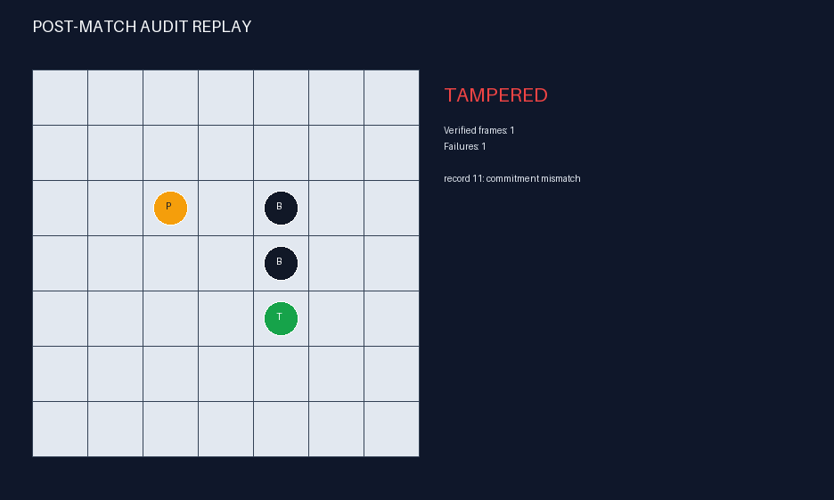

# Local-Truth GUI and Verified Replay

Run `thief-agent gui --config config/game.json --state
artifacts/matches/runtime/live.json` in a second process while the peer is active. The peer
atomically publishes safe snapshots after reveals.

The Tkinter live window consumes only `LiveSnapshot`. Its type contains local Thief
position, known barriers, observed Police scent, Police belief, hints, tokens, network
state, subgame/step, token owner, latest protocol event, terminal reason, and audit state.
It has no field for objective Police position or movement. A public barrier or
imprisonment capture is claimed before the terminal snapshot is written, so the monitor
can safely show the claim, final-audit transition, verified reason, and score.

Each heat layer is normalized against its own current peak so accumulated scent cannot
wash out the probability layer. Red is relative Police belief, blue is relative Police
scent, purple is overlap, green `T` is the local Thief, and black is a public barrier.
The row and column labels use the game's top-left, zero-based coordinates.

After final nonce disclosure, `ReplayVerifier` checks the whole-log mutual hash, every turn
commitment, and every physical transition before reconstructing objective state. Altered,
deleted, reordered, or illegal records produce exact `TAMPERED` status. Valid logs produce
exact `Verified OK`.

The PNG evidence renderer uses the same information-safe presentation model and supports
headless CI. The interactive replay window exposes full Police and Thief positions only
post-match.
